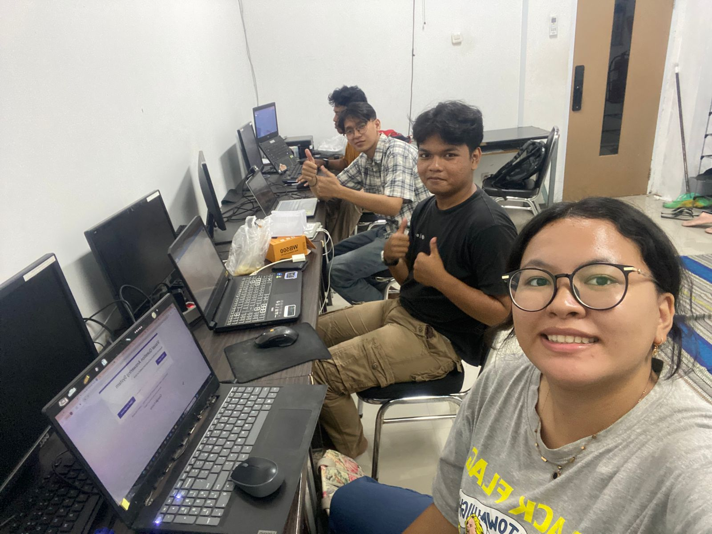

# FaceFit-Blink-Challenge
Game interaktif yang memanfaatkan kamera web dan MediaPipe Face Mesh untuk menampilkan bagian wajah alis, mata, hidung, mulut yang jatuh dari atas layar. Pemain harus mengedipkan mata tepat waktu agar bagian yang jatuh berhenti dan menempel di posisi wajah yang sesuai, sampai wajah tersusun lengkap secara real time.

# Nama dan NIM 
1. Lucky Immanuel Sitanggang (122140179)
2. Rachel Olivia Manullang (122140181)
3. Eric Arwido Damanik (122140157)

# Logbook Mingguan Kerkom

Memperbaiki Error pada kedipan dan wajah yang tidak mau turun semua 

## Persyaratan
- Python 3.11 (disarankan; versi 3.12 memiliki konflik dependensi antara MediaPipe dan TensorFlow/protobuf)
- Kamera web aktif
- `pip` terkini

## Instalasi
1. **Pastikan Python 3.11 terpasang.** Unduh dari [python.org](https://www.python.org/downloads/) atau gunakan package manager pilihan Anda.
2. Buka terminal di akar repositori ini dan buat virtual environment:
   ```powershell
   py -3.11 -m venv .venv
   ```
3. Aktifkan virtual environment:
   ```powershell
   .\.venv\Scripts\Activate
   ```
4. Perbarui `pip` dan pasang dependensi:
   ```powershell
   python -m pip install --upgrade pip
   pip install -r requirements.txt
   ```

> **Catatan:** Bila memakai interpreter selain Python 3.11 dan muncul error terkait `protobuf` atau TensorFlow, turunkan versi protobuf dengan `pip install --force-reinstall "protobuf>=4.25.3,<5"` atau beralih ke Python 3.11.

## Menjalankan Game
1. Pastikan virtual environment aktif.
2. Jalankan:
   ```powershell
   python main.py
   ```
3. Tekan `q` untuk keluar dan `r` untuk reset permainan.

Selamat bermain!
